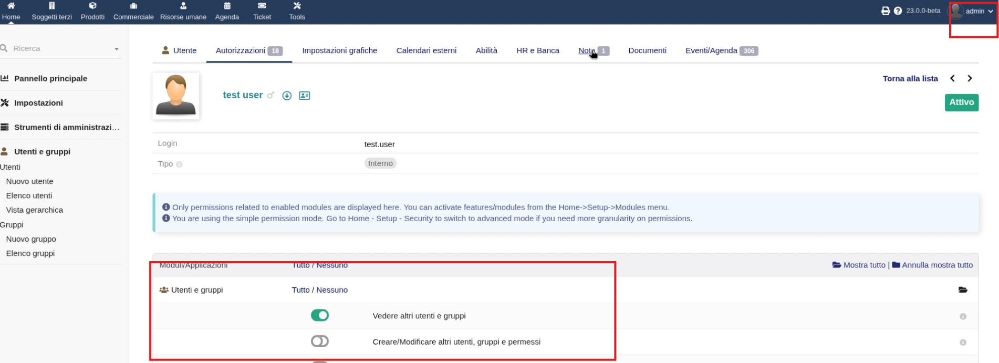
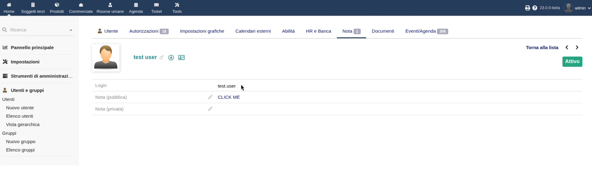
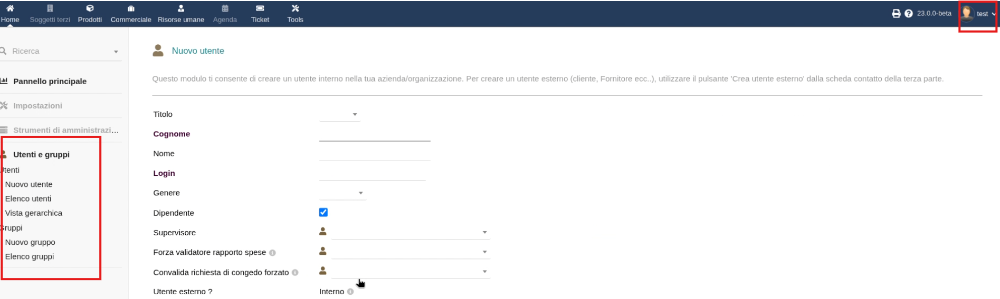

# CVE-2025-69634: Privilege Escalation Vulnerability in Dolibarr ERP & CRM 22.0.9

Research and report by **Simone Biondi**

---
Affected product: Dolibarr ERP&CRM

Vulnerability: PrivEsc (HTML injection + CSRF)

Version: 22.0.9 (maybe all before 22*, but not tested)

## Pre-requisites

User has to steal the token: since the token is passed into URL, an attacker could sniffing a misconfigurated network, read the browser history, perform phishing, read traffic through a proxy... the following PoC assumes that user already knows the token, due the CVE is related to CSRF.

## Summary

A critical vulnerability was identified in Dolibarr ERP/CRM where:

- **Administrator permission changes** are executed via **HTTP GET**
- The **anti-CSRF token is exposed in the URL**
- Low-privileged users can perform **HTML injection** on notes/fields

When an administrator views the injected content and clicks the link, the attacker **immediately gains admin rights**.

---

## Impact

| Impacted Area | Severity |
|--------------|:-------:|
| Access Control Integrity | Critical |
| Privilege Escalation | Critical |
| Admin Account Takeover | Critical |

### CVSS v3.1 
**9.0 — Critical** (AV:N/AC:L/PR:L/UI:R/S:C/C:H/I:H/A:H)

| CWE | Title |
|--------------|:-------:|
| CWE-352 | Cross-Site Request Forgery |
| CWE-598 | Information Exposure in Query Strings |
| CWE-284 | Improper Access Control |

---

## Root Causes

- State-changing actions executed via **GET**
- CSRF token placed in **query string**
- HTML injection in user-controlled fields
- No confirmation before privilege modification

The intersection of these behaviors leads to a **Stored Priv-Esc chain attack**.

---

## Screenshots

| Screenshot | Description |
|-----------|-------------|
|  | Link inserted by low-privileged user |
|  | Admin view of user rights page |
|  | Admin clicking the injected link |
|  | Attacker now has admin permissions |

---

## Mitigations (suggested to vendor)

- Convert **all permission-changing actions** to POST
- Remove CSRF tokens from URLs (store in POST body)
- Add confirmation dialog on admin permission changes
- Add `Referrer-Policy: strict-origin`
- Additional validation on HTML rendering contexts

---

## Versions Affected

- 22.0.9
- patch: [TBD]

---

## Disclosure Timeline

Following the [policy](../policy.md)

| Date | Event |
|------|-------|
| 2025-12-03 | Vulnerability discovered |
| 2025-12-04 | Report sent to Dolibarr Security Team |
| 2025-12-09 | PM the Tech Lead |
| 2025-12-16 | Request CVE to MITRE (vendor didn't answer) |
| *Pending* *| Fix developed and released |
| 2026-02-05 | CVE assignment |
| 2026-02-12 | Public disclosure allowed |

* Vendor disputed the vulnerability, since he affirms there is no risk to put token inside a GET and for him a user can't never steal it
---

## Credits

**Researcher:**  
*Simone Biondi*  

---

